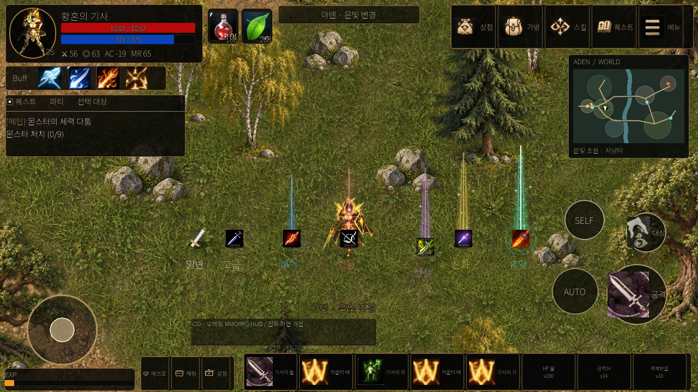
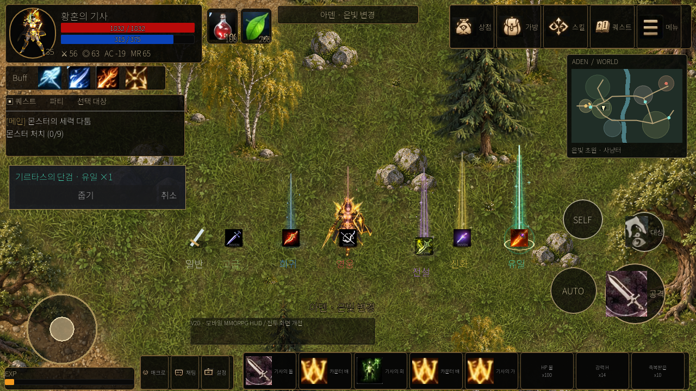
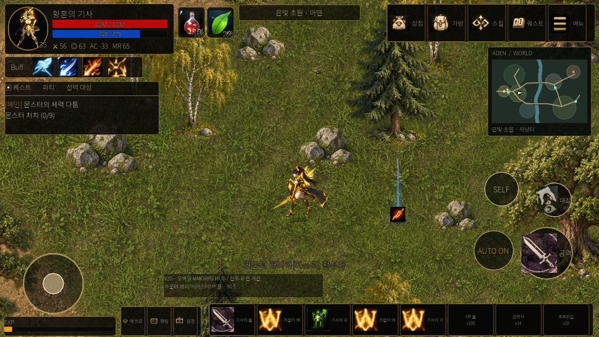

# 바닥 드랍 실제 게임 화면

Godot 4.7.2의 실제 OpenGL 화면이다. 개발용 등급 샘플을 생성했으며 게임의
드랍 확률은 변경하지 않았다. 캡처 기준 코드는
`88b726eef967e141877a45e27f7e6f9c3c79e152`이다.

[화면 캡처와 172항목 검증 실행](https://github.com/zoog136-hash/-/actions/runs/37860231093)은
통과했다. 캡처 스크립트는 등급별 표시, 수동 선택, AUTO 접근의 세 PNG를 생성한다.

## 일곱 등급

일반·고급은 아이템만 표시하고, 희귀부터 파랑·빨강·보라·금색·에메랄드 빛기둥을 사용한다.

## 수동 선택과 줍기

아이템 선택 표시와 이름·등급·수량, 줍기·취소 버튼이다. 확인 창은 퀘스트 창 아래에
위치하여 미니맵과 전투 버튼을 가리지 않는다.

## 자동사냥 중 습득 접근

AUTO가 켜진 상태에서 바닥 희귀 아이템이 표시되고 캐릭터가 경로를 따라 접근한다.
실제 이동·습득·다음 몬스터 공격 재개는 같은 실행의 통합 검사에서 확인한다.

